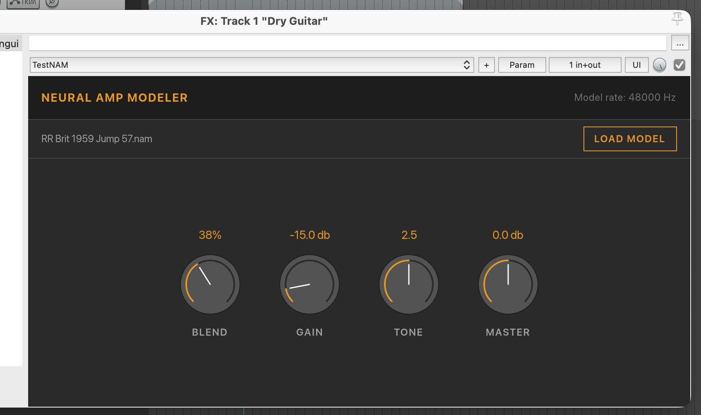

## Unofficial Cross Platform Neural Amp Modeler Plugin

> MacOS, Windows and Linux
> Tested in MacOS and Linux with REAPER



### Dependencies

```bash
git submodule update --init --recursive

cd external/clap-1.2.7
git checkout tags/1.2.7

cd external/neural-amp-modeler-0.5.1
git checkout tags/v0.5.1
```

### Dev

```bash
RUST_BACKTRACE=full watchexec -r -e html,css,rs -- just build
```

### Build

```bash
just build
```

### Validate plugin

```bash
clap-validator validate X
clap-info X
```
